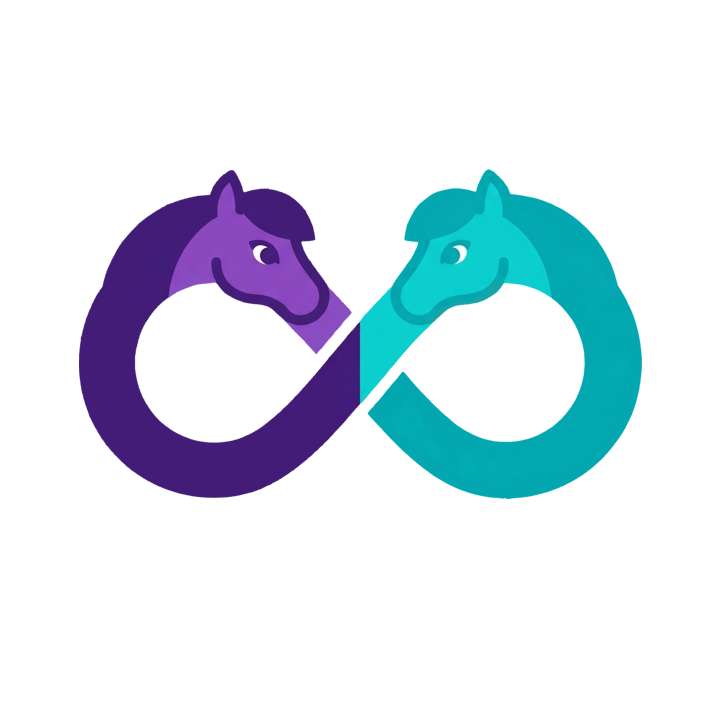

<div align="center">

<p>
    <a href="https://www.patreon.com/JasminDreasond"></a>
    <a href="https://ko-fi.com/jasmindreasond"></a>
    <a href="https://chain.so/address/BTC/bc1qnk7upe44xrsll2tjhy5msg32zpnqxvyysyje2g"></a>
    <a href="https://chain.so/address/LTC/ltc1qchk520v4u8334n5dntmgeja55gc5g5rrkgpd4f"></a>
    <a href="https://commerce.coinbase.com/checkout/817de5cb-d88e-4d79-8af3-a4b8696f2f2a"></a>
</p>
</div>

# Philomena Multi-Booru 🦄

Welcome to **Philomena Multi-Booru**! This is an advanced and highly customizable gallery viewer built specifically to run multiple instances of Derpibooru (and other Philomena-based boorus) in a single, unified interface.

If you regularly browse different boorus and want a seamless way to aggregate your searches, manage your favorite artists, and view high-quality artwork without juggling multiple browser tabs, this project is for you!

## ✨ Key Features

* **Multi-Instance Support:** Connect and seamlessly switch between multiple Derpibooru-style instances.
* **Unified Searching & Pagination:** Browse through images from different boorus with a smart local cache system that keeps your pagination intact.
* **Rich Media Player:** Integrated with Plyr for a smooth, customizable video playback experience (supports autoplay, loop, and mute settings).
* **Deep Customization:** A built-in theme editor allows you to change global colors, text styles, and interaction symbols to match your aesthetic perfectly.
* **Optional In-App Viewing:** Check out images, read comments, and explore user profiles without ever leaving the app.

## 🚧 Philomena API Limitations

This entire application is built around and strictly limited by the capabilities of the official **Philomena API**. 

Because we rely entirely on the endpoints provided by the platform, not every native website feature can be brought into this app right now. However, the project is actively maintained! Whenever the Philomena API receives updates that open the door for new functionalities, they will be implemented here as soon as possible.

## 🔒 Privacy & Security First

Your data is *yours*. **Philomena Multi-Booru does not collect, track, or send any of your personal information to external servers.** * **Local Storage Only:** Everything—from your cached images and search history to your custom themes—is stored locally in your browser using IndexedDB (JsStore) and LocalStorage.
* **API Key Responsibility:** Because your API keys are saved directly within your browser's local environment, keeping them secure is entirely your responsibility. Treat your browser and device security with care, and never share your exported app data if it contains your keys.

## 🚀 Getting Started

1. Clone this repository:
   ```bash
   git clone [https://github.com/JasminDreasond/Philomena-Multibooru.git](https://github.com/JasminDreasond/Philomena-Multibooru.git)
```

2. Install the dependencies:
```bash
yarn
```


3. Start the development server:
```bash
yarn dev
```


4. Open the app, head to the **Settings** panel, and add your favorite Booru URLs along with your API keys to start syncing!

## 🛠️ Built With

* [React](https://react.dev/)
* [JsStore](https://jsstore.net/) (IndexedDB wrapper)
* [Plyr](https://plyr.io/)
* [Bootstrap](https://getbootstrap.com/)

### Available tasks in the project

- Arts to replace AI Images in the project.

---

Enjoy your unified browsing experience! If you run into any issues or have feature requests (that the API allows!), feel free to open an issue.

> 🧠 **Note**: This documentation was written by [Gemini](https://gemini.google.com), an AI assistant developed by Google, based on the project structure and descriptions provided by the repository author.  
> If you find any inaccuracies or need improvements, feel free to contribute or open an issue!


<div align="center">
Made with tiny love!
</div>
